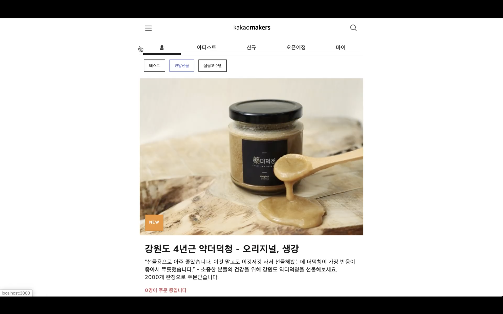

## Introduction

[카카오메이커스](https://makers.kakao.com/) 클론 프로젝트
프로젝트 목표는 e-commerce 사이트의 기본적인 회원 가입과 유지, 상품 조회, 주문입니다. 프론트 3명, 백엔드 1명으로 진행하였습니다. 트렐로를 이용하여 task를 배분하였으며 스크럼을 통해 프로젝트 진행 기간 동안 각자의 진행 사항을 공유하며 협업하였습니다.

## Spec

프론트엔드는 React, SCSS, CSS Module , ESLint, Prettier, Git 등을 이용하여 협업하였으며 컴포넌트를 만드는 데 있어서 추가적인 libraray들을 사용. 프로젝트 구조로 atomic design을 변형하여 atoms, components, pages 세 가지 구조로 구성. EC2를 이용하여 서버 배포 작업 중입니다.

## Features

- 회원가입 인가
- 로그인, 로그아웃 인증
- 커머스 상품 목록 가져오기
- 상품 좋아요 기능 구현
- 상품 디테일 페이지 구현
- 상품 주문 담기 구현

## Install & Run

```
npm install
npm run dev
# or
yarn
yarn dev
```

Deploy(Currently Back-End Server is Closed)

```
http://54.95.3.37/
```

## Demo

[](https://youtu.be/MQKf-NArRn0)

- [backend](https://github.com/wecode-bootcamp-korea/weMakers_backend) git

## Contact

- youngnam Kim, kimhyoungnams@gmail.com
- Dahye Yu, dahye.yu.dev@gmail.com
- Seunggeun Yu, yousk6347@gmail.com
